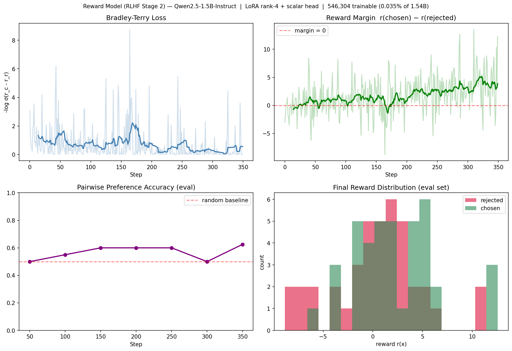

# Reward Model from Scratch — RLHF Stage 2

<p align="center">
  
  
  
  
  
  
</p>

> **Stage 2 of the classical RLHF pipeline — a scalar reward model trained from scratch.**
> Attaches a linear reward head on top of a frozen Qwen2.5-1.5B-Instruct backbone with LoRA adapters, then trains it with Bradley-Terry loss on Anthropic's HH-RLHF preference pairs. Runs end-to-end on an Apple M4 in under 8 minutes.

---

## Training Results



> **Top-left:** Bradley-Terry loss drives the scalar head to assign higher reward to chosen responses.
> **Top-right:** Reward margin `r(chosen) − r(rejected)` grows from ~0 → +12.3 on training pairs.
> **Bottom-left:** Pairwise preference accuracy on held-out eval climbs from 0.50 → **0.625**.
> **Bottom-right:** Final reward distribution — chosen responses (green) are visibly shifted right of rejected (red).

---

## Key Metrics

| Metric | Value | Notes |
|---|---|---|
| Final BT loss | **0.0** | Converged on training pairs |
| Reward margin (train) | **+12.32** | r(chosen) − r(rejected) |
| Mean r(chosen) on eval | **+2.26** | Held-out, never seen during training |
| Mean r(rejected) on eval | **+0.43** | Held-out |
| **Reward gap on eval** | **+1.83** | Real separation → generalises |
| **Preference accuracy (eval)** | **0.625** | 25 % above 0.50 random baseline |
| Trainable parameters | **546,304** | 0.035 % of 1.54B (LoRA + head) |
| Training time | **7.8 min** | Apple M4 MPS, float16 backbone |

The reward gap of **+1.83 on unseen pairs** is the primary learning signal: the scalar head has learned a genuine preference function, not memorised the training set.

---

## What This Demonstrates

### 1. Bradley-Terry Preference Model from Scratch
The original RLHF objective (Christiano et al. 2017, InstructGPT) implemented in pure PyTorch:

```
L_BT = -E_{(x, y_w, y_l) ~ D} [ log σ( r_φ(x, y_w) − r_φ(x, y_l) ) ]
```

- `r_φ(x, y)` = scalar reward produced by a linear head on the last non-pad hidden state
- Loss pushes `r(chosen) > r(rejected)` by a confident margin
- Symmetric and monotonic — exactly the Bradley-Terry probabilistic ranking model

### 2. Scalar Reward Head
A single linear layer mapping the final hidden state to a scalar:

```python
class RewardHead(nn.Module):
    def __init__(self, hidden_size):
        self.proj = nn.Linear(hidden_size, 1, bias=False)

    def forward(self, hidden_states, attention_mask):
        last_idx = attention_mask.sum(-1) - 1            # last real token
        h_last   = hidden_states[batch_idx, last_idx]
        return self.proj(h_last.float()).squeeze(-1)     # scalar r(x)
```

- 1,536 parameters (hidden_size → 1)
- Reads from the last non-pad token — standard reward-model convention
- Float32 for stable scalar regression on top of a float16 backbone

### 3. LoRA Backbone (Shared with DPO-3B)
Same `LoRALinear` drop-in as the companion DPO project — injected only into `q_proj` and `v_proj`:

- 544,768 trainable adapter params
- Base model fully frozen
- float32 adapters on float16 base

---

## Architecture

```
┌──────────────────────────────────────────────────────────────┐
│              Qwen2.5-1.5B-Instruct  (28 layers)              │
│                     float16 · frozen                          │
│                                                               │
│  Layer 0 … 27                                                 │
│  ┌──────────────────────────────────────────────────┐         │
│  │  Self-Attention                                    │         │
│  │   q_proj ──► LoRALinear(rank=4)  ◄── TRAINABLE    │         │
│  │   v_proj ──► LoRALinear(rank=4)  ◄── TRAINABLE    │         │
│  │   k_proj, o_proj, MLP            ◄── frozen       │         │
│  └──────────────────────────────────────────────────┘         │
│                                                               │
│                 last_hidden_state (1, T, 1536)                │
│                           │                                   │
│                  last non-pad token                           │
│                           ▼                                   │
│              RewardHead: Linear(1536 → 1)  ◄── TRAINABLE      │
│                           ▼                                   │
│                   scalar reward  r(x)                         │
└──────────────────────────────────────────────────────────────┘
  Total trainable: 546,304 params  (0.035 % of 1.54B)
```

**Per training step — 2 forward passes, 1 backward:**

```
Input pair: (chosen ✅, rejected ❌)

  backbone + head  →  r(chosen)    ─┐
                                     ├─► margin = r_c − r_r
  backbone + head  →  r(rejected)  ─┘        ▼
                                      loss = −log σ(margin)
                                             ▼
                                        backprop
                              (only LoRA A,B and head.proj updated)
```

---

## Where This Sits in the RLHF Pipeline

```
Stage 1:  SFT              →   supervised fine-tune on demonstrations
Stage 2:  Reward Model     →   THIS PROJECT — learn r(x) from preferences
Stage 3:  PPO / RLHF       →   optimise policy against r(x) with KL penalty

Alternative (DPO):         →   collapse stages 2 + 3 into one loss
```

| Aspect | This Reward Model | DPO-3B (companion) |
|---|---|---|
| Forward passes / step | **2** | 4 |
| Reference model needed | No | Yes (single-model trick) |
| Produces reusable artefact | **Explicit r(x)** | Implicit reward only |
| Training time (same HW) | **7.8 min** | 25 min |
| RLHF stage covered | Stage 2 | Stage 2 + 3 collapsed |

The explicit scalar reward this project produces is the same type of artefact that drives PPO in ChatGPT / Claude training — DPO is mathematically equivalent but does not yield a standalone reward function.

---

## Hardware & Software

| | |
|---|---|
| Hardware | MacBook Air M4, 16 GB unified memory |
| Device | Apple MPS (`torch.backends.mps`) |
| Dtype | float16 (base) + float32 (LoRA adapters, reward head) |
| Python | 3.9 |
| PyTorch | 2.x with MPS backend |
| Transformers | HuggingFace `transformers` |
| Dataset | `Anthropic/hh-rlhf` harmless-base split |

---

## Hyperparameters

| Parameter | Value | Rationale |
|---|---|---|
| `LORA_RANK` | 4 | Minimal footprint; sufficient for reward signal |
| `LORA_ALPHA` | 8 | Scale = alpha/rank = 2 |
| `LR_LORA` | 2e-4 | Standard LoRA learning rate |
| `LR_HEAD` | 1e-3 | Reward head starts untrained → benefits from higher LR |
| `MAX_LEN` | 128 | Attention is O(n²); keeps per-step cost low |
| `GRAD_ACCUM` | 2 | Simulates batch size 2 without extra memory |
| `N_STEPS` | 350 | ~7.8 min on M4; enough for eval accuracy to reach 0.625 |
| `N_TRAIN` / `N_EVAL` | 200 / 40 | Held-out eval never seen by gradients |

---

## Training Curve

```
step   0 | loss=3.0851 | margin=-3.04   ← head untrained, random init
step  20 | loss=4.1860 | margin=-4.17   ← early instability
step  60 | loss=0.0022 | margin=+6.10   ← starts fitting training pairs
step 100 | loss=0.1467 | margin=+1.85   ← eval acc = 0.550
step 140 | loss=0.0254 | margin=+3.66   ← eval acc = 0.600
step 200 | loss=0.8356 | margin=-0.27   ← noisy — hard example
step 260 | loss=0.0152 | margin=+4.18
step 300 | loss=0.0492 | margin=+2.99
step 350 | loss≈0.0    | margin=+12.32  ← final   eval acc = 0.625
```

---

## Quickstart

```bash
# 1. Clone
git clone https://github.com/ajaykumarsoma/RewardModel.git
cd RewardModel

# 2. Install dependencies
pip install torch transformers datasets matplotlib numpy

# 3. Run  (Apple MPS auto-detected; falls back to CPU)
python experiment.py
```

Expected output on Apple M4:
```
Device : mps
Model  : Qwen/Qwen2.5-1.5B-Instruct
Base params    : 1.544B  (frozen)
LoRA trainable : 544,768  (0.0353%)
Head trainable : 1,536   (1536 → 1)
Train pairs : 200   Eval pairs : 40
Training for 350 steps ...
```

Outputs written to:
- `plots/reward_model_results.png` — 4-panel figure (loss, margin, eval accuracy, reward histograms)
- `results.json` — full metrics dictionary

---

## Why This Matters for AI Safety

Reward modelling is the component of the RLHF pipeline that most directly encodes **what humans actually want**. A reward model:

- **Operationalises preferences.** Human judgements of "this response is better than that one" become a differentiable scalar signal a model can be optimised against.
- **Is the source of most real-world alignment failures.** Reward hacking, sycophancy, and specification gaming all trace back to mis-specified reward models — understanding how one is built from scratch is prerequisite to studying those failure modes.
- **Is reusable and auditable.** Unlike DPO's implicit reward, this scalar `r(x)` can be inspected, probed, and used to score arbitrary outputs offline.

The same Bradley-Terry architecture trained here scales directly to the 6B–70B reward models used in production RLHF (InstructGPT, Llama 2-Chat, Claude). The only differences at scale are backbone size, dataset size, and optional ensembling.

---

## Related Projects

| Project | What it adds |
|---|---|
| [DPO-3B](https://github.com/ajaykumarsoma/DPO-3B) | Stages 2+3 collapsed into a single loss — same dataset, same hardware |
| [RepresentationEngineering](https://github.com/ajaykumarsoma/RepresentationEngineering) | Inference-time alignment via activation steering — no fine-tuning |
| [SparseAutoencoder](https://github.com/ajaykumarsoma/SparseAutoencoder) | Feature-level interpretability of the base model |

---

## Citation

```bibtex
@inproceedings{christiano2017deep,
  title     = {Deep Reinforcement Learning from Human Preferences},
  author    = {Christiano, Paul F and Leike, Jan and Brown, Tom and Martic, Miljan
               and Legg, Shane and Amodei, Dario},
  booktitle = {Advances in Neural Information Processing Systems (NeurIPS)},
  year      = {2017}
}

@article{ouyang2022training,
  title   = {Training language models to follow instructions with human feedback},
  author  = {Ouyang, Long and Wu, Jeffrey and Jiang, Xu and others},
  journal = {Advances in Neural Information Processing Systems},
  year    = {2022}
}
```

---

*Built as part of a mechanistic interpretability and AI safety portfolio.
All components implemented from scratch to demonstrate technical depth.*
